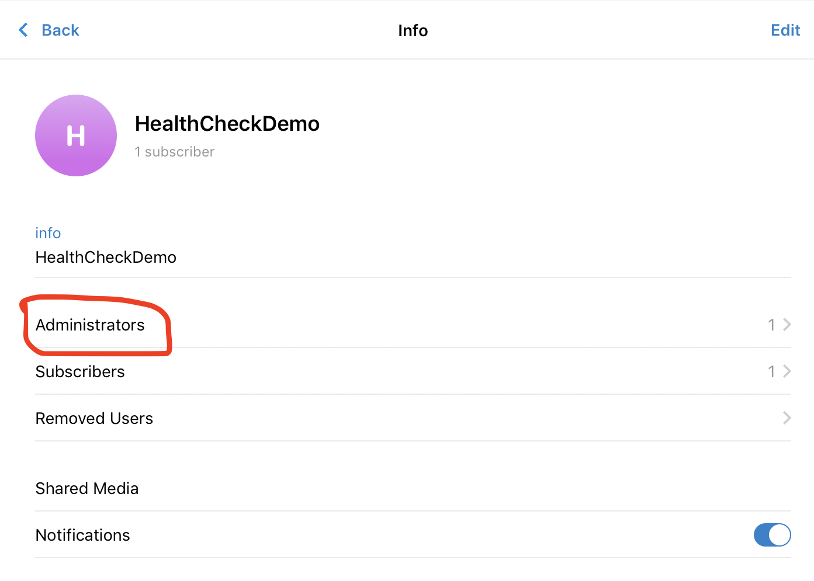

# Healthcheck bot

> Be the first one to know that your website is down!

Node app to notify a user via telegram(or other messengers in the future releases) that their url endpoint is not responding.

## Demo

### chat

- Alert message is sent when the website is down
- also you can type `/check` command to check all urls provided


### web ui


## Prerequirments

### Telegram bot

1. First you need to create telegram bot using botfhather more details [here](https://core.telegram.org/bots#3-how-do-i-create-a-bot)

2. Create public channel to which bot is going to send messages

3. Add your new bot to channel administators




## Usage

### Env variables

You must provied environment variables to run an app

- BOT_TOKEN(**required**) - token of your telegram bot
- TELEGRAM_CHANNEL(**required**) - name of your channel(e.g., `@mypublicchannelname`)
- URLS(**required**) - string of urls separated by comma(e.g, `https://google.com,https://facebook.com`)
- PORT(_optional_) - port of express app(default: 8080)
- TIMEOUT(_optional_) - gap in miliseconds between healthchecks(default: 10000)

### node app

install dependencies

```
npm install
```

build

```
npm run build
```

environment variables must be exposed or you can write then in `.env` file and then run

```
npm start
```

### docker

App is also availible as docker container

## TODO

- [ ] Add other messengers support(what's up, slack, viber)
- [ ] Add verbose name for urls
- [ ] add triggers for urls when they are down

### run

Assuming you have `.env` file with all needed variables

```
docker run -p 49160:8080  --env-file=.env  eddylazar/healthcheck-bot
```

## Built With

- [node-telegram-bot-api](https://github.com/yagop/node-telegram-bot-api)

## Contributing

Pull requests are welcome. For major changes, please open an issue first to discuss what you would like to change.

Please make sure to update tests as appropriate.

## License

MIT
